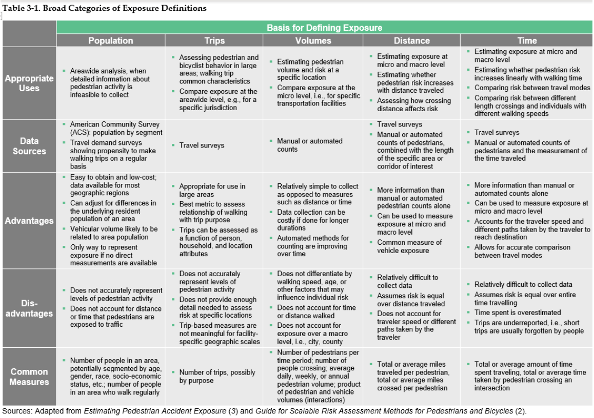

# Overview

Learning about how to quantify pedestrian risk.

This is commonly done using measurements of "exposure" that pedestrians face on a road. Stuff like crosswalks, lights, speed limits, etc are influence the risks to pedestrians. 

**Source:** [Direct Link](https://onlinepubs.trb.org/onlinepubs/nchrp/nchrp_rpt_992Safety.pdf)

## Exposure

**Definition:** A measure of the number of potential opportunities for a crash to occur. 

### Categories of Exposure Measures

- Population-based: People who regularly walk in an area.
- Trip-based: Number of walking trips to an area.
- Volume-based: Pedestrian or motorized traffic volume along a facility or crossing at an intersection.
- Distance-based: Total length treaveled by pedestrians, e.g., along a facility or across a crossing.
- Time-based: Total time spent by persons while walking, e.g., person hours of travel along a facility or time to walk across a crossing. 

It seems volumes are most appropriate for our project, which is good because that's what I was planning to use anyway. 

The disadvantages are worth keeping in mind here. This method doesn't differentiate between walking speeds, age, etc. Upside for simplicity, but it loses some nuance. Doesn't account for time or distance walked either, which is relevant from our 5 lane crossing. 

### Exposure scale and coverage

We'll be looking at **Facility-specific** exposure with this project. 

- Street crossing example: The number of pedestrians crossing an intersection and the number of vehicles conflicting with pedestrians can be used to estimate exposure for each crossing movement. 

## Pedestrian Analysis Data Needs

**Critical:**
- Vehicle-pedestrian crashes, including location, time and severity.
- Traffic volumes
- Some measure of pedestrian exposure to crash risk. 
- Road characteristics

## Countermeasure performance measures

- Crash frequency: Number of crashes occurring per year or other unit of time.
- Crash rate: Number of crashes normalized by a population or metric of exposure. 
    - Crashes per 100k people in a city
    - Crashes per miles traveled
    - etc. 

## Crash reduction

- **Crash modification factors**
    - Provide an estimate of a countermeasures ability to reduce certain types and severities of crashes following installation.
- **Safety performance functions (SPF)**
    - Estimate the average number of crashes at a particular location based on certain characteristics present at the location. (traffic volume, traffic speed)

# Estimating pedestrian and bicyclist exposure to risk... 

Source: [Direct link](https://highways.dot.gov/sites/fhwa.dot.gov/files/2022-06/fhwasa17014.pdf)

## Definitions of risk and exposure in transportation safety

- **Risk:** Measure of the probability of a crash to occur given exposure to potential crash events.
- **Exposure:** A normalization factor (denominator) to equalize for differences in the quantity of potential crash events in different road environments. 

Common definition:

$$
\text{Risk} = \frac{\text{Expected or measured crashes, by kind and severity}}{\text{Exposure}}
$$

Most theoretical definitions of exposure are similar, but operational definitions vary a lot. These definitions differ depending on the scale of the analysis and availability of data. 

Some examples:
- Pedestrian volume
- Sum of entering flows at intersection
- Product of pedestrian or cyclist volume (P and B) and motor vehicle volume (V), (P or B) x V.
- Square root of the above product. 
- Estimated number of streets or travel lanes crossed
- etc etc